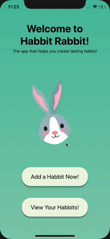

# Habbit Rabbit

## About Habbit Rabbit
Habbit Rabbit is an iOS App built with Expo and React-Native that tracks productive habits that you want to build and monitors your progress towards developing them. This repo holds the front-end. The back-end Repository can be found [here](https://github.com/tjeve/habbitRabbit-backend2).

## Technologies Used for the front-end.
| Technology                        | Purpose                          |
|----------------------------------|----------------------------------|
| [Expo](https://expo.io/)     | Expo is a framework and a platform for universal React applications. It is a set of tools and services built around React Native and native platforms that help you develop, build, deploy, and quickly iterate on iOS, Android, and web apps from the same JavaScript/TypeScript codebase. |
| [React-Native](https://facebook.github.io/react-native/)         | React Native combines the best parts of native development with React, a best-in-class JavaScript library for building user interfaces. |
| [React-Redux](https://react-redux.js.org/)       | React Redux is the official React binding for Redux. It lets your React components read data from a Redux store, and dispatch actions to the store to update data.       |
| [redux-thunk](https://github.com/reduxjs/redux-thunk)     | A Predictable State Container for JS Apps       |
| [react-native-fbsdk](https://github.com/facebook/react-native-fbsdk)     | React Native FBSDK is a wrapper around the iOS Facebook SDK and Android Facebook SDK, allowing for Facebook integration in React Native apps. Access to native components, from login to sharing, is provided entirely through documented JavaScript modules so you don't have to call a single native function directly.      |
| [react-native-gesture-handler](https://software-mansion.github.io/react-native-gesture-handler/docs/getting-started.html)     | Gesture Handler aims to replace React Native's built in touch system called Gesture Responder System.      |
| [Redux](https://redux.js.org/)     | A Predictable State Container for JS Apps       |

## Authentication
a Facebook Oauth is used as the method for authentication. Users are redirected to facebook to log in, then are redirected back to Habbit Rabbit.

## Potential Future Developments
* Adding a method to track how many times a user completes a "habbit" verses how many days they have left out of 66 may be useful for users
who are interested in how many times they performed a particular habbit within the 66 days.
* Users might also like to know the last time they "checked in" to their "habbit." In order to make this happen a new table would need to be added to the database with id, habit, and time_stamp columns.
* Deploy the server and database.

## Collaborators
* [Gaura Klein](https://github.com/Gauraklein)
* [Terrence J. Eveline](https://github.com/tjeve)

